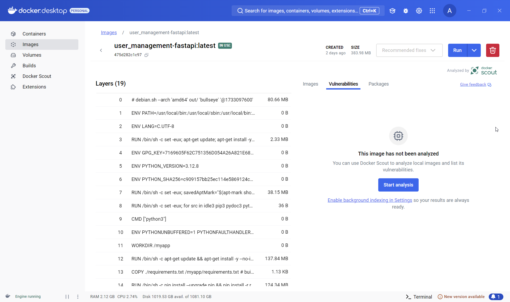

## Alexander Boyd
## IS218-001
## Final Project Reflection Document
## Repo Link: https://github.com/AlexandersWrld/user_management 
## Deployment link: https://github.com/AlexandersWrld/user_management/deployments 

For my final I chose to do the User Profile Management Feature (yes, I know, the easiest one from the list). To implement this feature, I created a brand-new endpoint / user interface that would allow users to manually update their profile information. Users are now able to manage and change their profile information dynamically, being able to change just their name, or being able to edit all their profile information. This endpoint followed the principles of CRUD and leveraged the UserUpdate functionality already built into the application. A part of this feature was an additional field that allowed both users and admins to change a user’s professional status, as required by the project instructions. The implementation of this project did in fact prove to be something of a challenge, but it really was not too difficult; a bit of tinkering around and I was able to get it working quickly (as quick as can be in terms of programming anyway). At first it was a little buggy but with some refinement, I was able to get it to a point where I was satisfied with it. There was a whole new heading added to the application that specifically contained my added feature. Admittedly, I was not able to do some of the optional enhancements, but I will take them as something to aspire toward moving forward. 
	
The most difficult part of this project was easily the testing portion of it, and not for a lack of trying. I found that much of the testing that was already implemented into the project was very robust. Time and time again, I would get an idea for a test that I could run, only to see that it had already been thought of and implemented already. Another challenge that I ran into with the testing, is that my initials tests weren’t very good; I started off writing them pretty poorly, but eventually I got a better understanding of how to construct them as I went forward. In the end , I was able to come up with 10 new test cases, that checked especially for a few fringe scenarios (such as ensuring that a locked user was not able to change their password and ensuring that the generated nicknames were URL-safe in the event that someone should share their profile). This portion of the project really showed me how extensive automated testing really needs to be for such robust applications; I can only imagine what goes into much larger, globally used applications. 

Each semester, I mentally assign a level of importance to each of my classes, and I would definitely say that this class has been the star of my semester. It has singlehandedly helped reshape the narrative I had in my head about programming and coding and has inspired me to potentially pursue back-end development or devops engineering as a career path.
